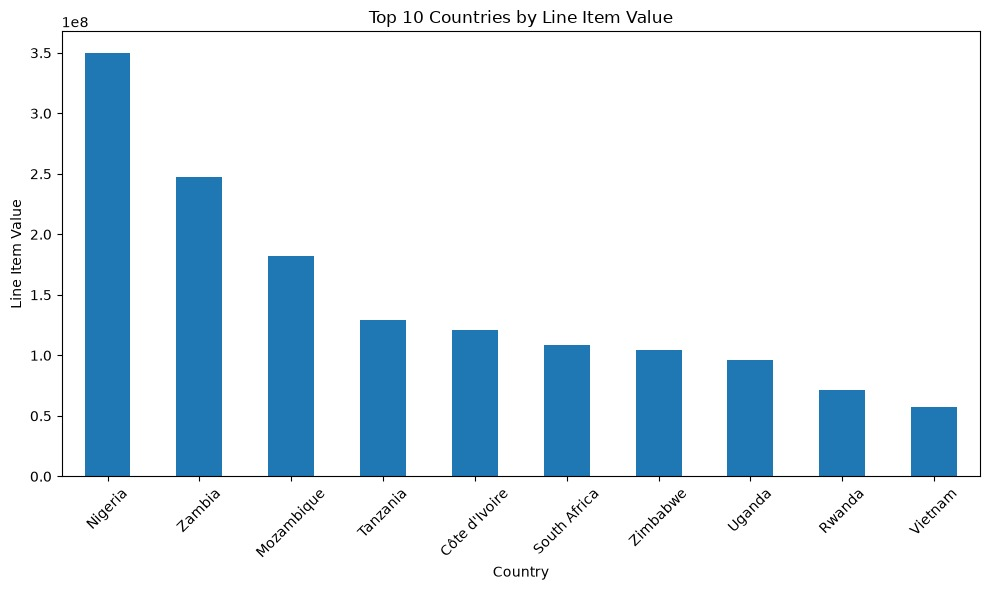
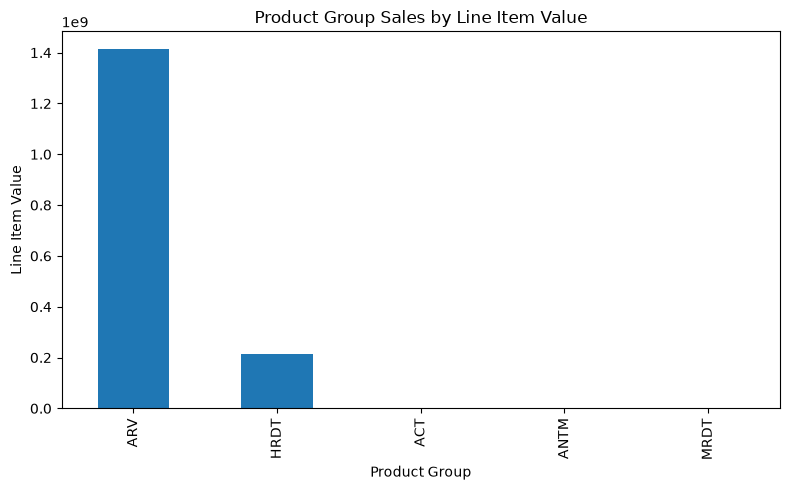
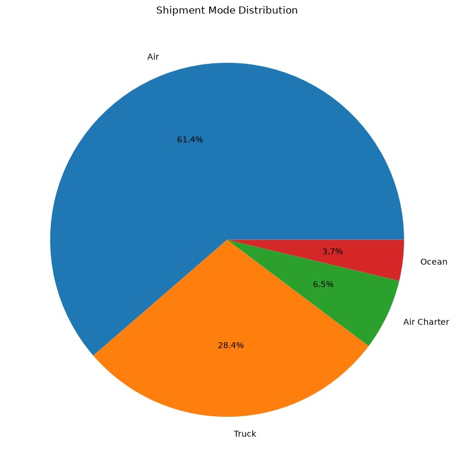
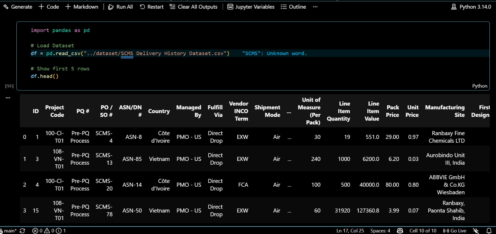
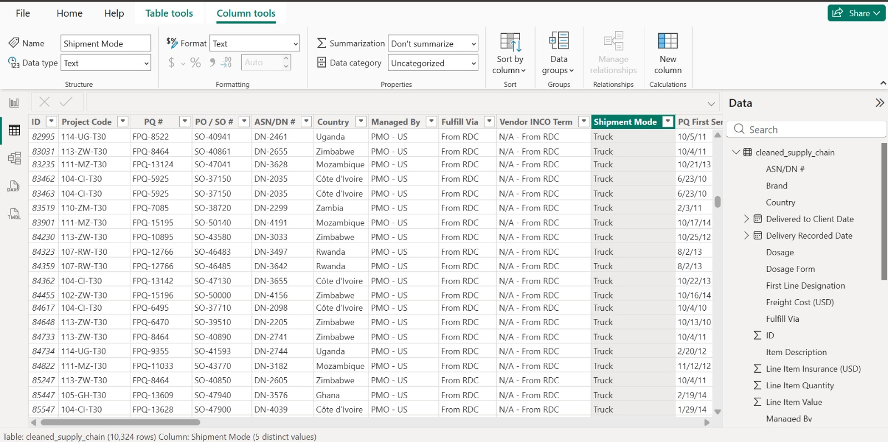
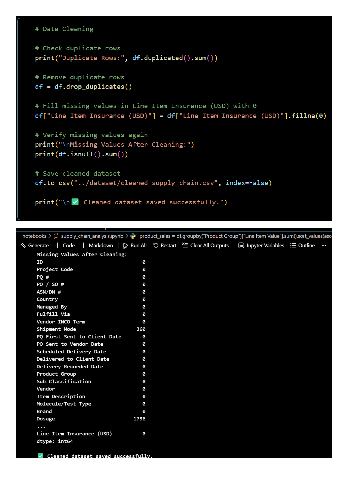
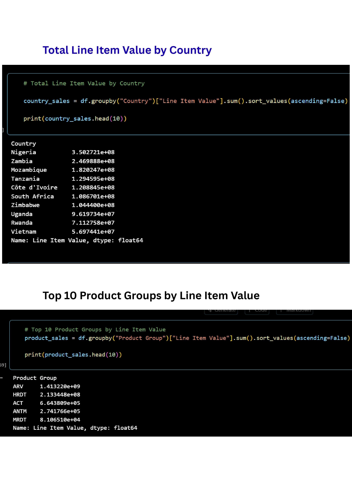
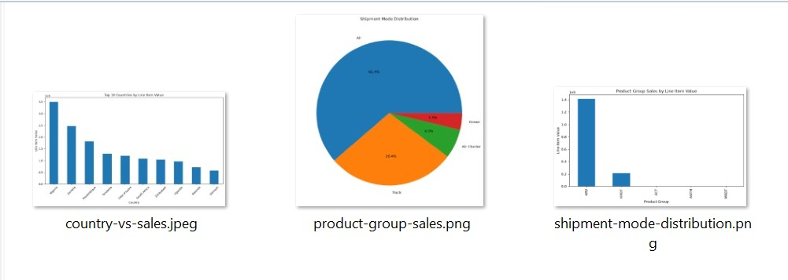
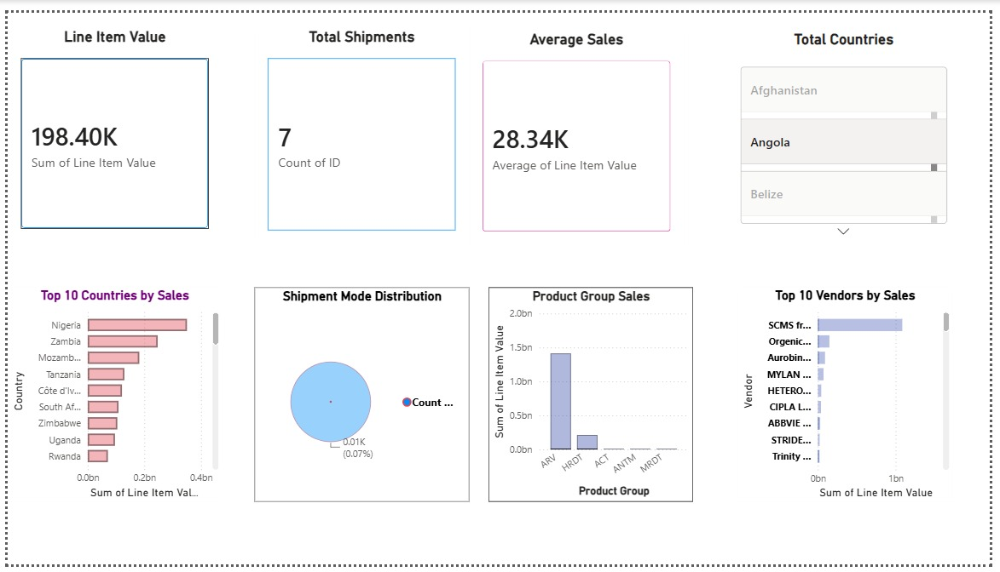
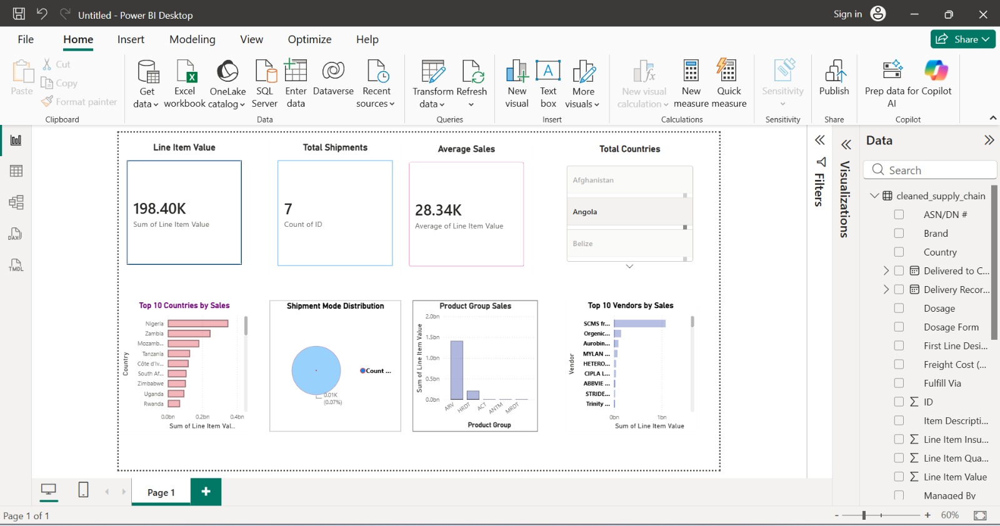

<div align="center">


<br/>


<br/>


<br/>


</div>

<br/>

---

# 📌 Project Overview

**Supply Chain Analytics** is an end-to-end data analytics project focused on analyzing shipment, logistics, vendor, product, delivery, and freight-cost data.

The project works with a real-world **SCMS (Supply Chain Management System) dataset containing 10,324 shipments and 33 features**.

The complete analytics pipeline transforms raw data into meaningful business insights through:

* 🐍 Python-based data analysis
* 🐼 Pandas data cleaning and manipulation
* 🔍 Exploratory Data Analysis
* 📊 Statistical and group-based analysis
* 📈 Matplotlib visualizations
* 💾 Cleaned dataset generation
* 📊 Interactive Power BI dashboard
* 💡 Business insights and recommendations

The goal is to demonstrate how raw operational data can be transformed into **clear, actionable insights for business and logistics decision-making**.

---

## 🎯 Project Objectives

* ✔️ Clean and preprocess raw supply chain data
* ✔️ Handle missing and inconsistent values
* ✔️ Convert incorrect data types into usable formats
* ✔️ Analyze shipment patterns and delivery performance
* ✔️ Identify high-performing and high-cost vendors
* ✔️ Analyze countries, product groups, and shipment modes
* ✔️ Study delivery delays and logistics trends
* ✔️ Generate meaningful data visualizations
* ✔️ Build an interactive Power BI dashboard
* ✔️ Extract actionable business insights
* ✔️ Provide recommendations based on analytical findings

---

# 🛠️ Technologies Used

<div align="center">

| Technology              | Purpose                                             |
| ----------------------- | --------------------------------------------------- |
| 🐍 **Python**           | Core programming and data analysis                  |
| 🐼 **Pandas**           | Data loading, cleaning, transformation and grouping |
| 🔢 **NumPy**            | Numerical operations                                |
| 📊 **Matplotlib**       | Data visualization                                  |
| 📓 **Jupyter Notebook** | Interactive data analysis                           |
| 📈 **Power BI**         | Dashboard creation and business intelligence        |
| 💻 **VS Code**          | Development environment                             |
| 🐙 **Git & GitHub**     | Version control and project management              |

</div>

---

# ✨ Key Features

* 📥 Raw dataset analysis
* 🧹 Comprehensive data cleaning
* 🔍 Exploratory Data Analysis
* 🌍 Country-wise shipment analysis
* 📦 Product group analysis
* 🚢 Shipment mode analysis
* 🏭 Vendor performance analysis
* ⏱️ Delivery delay analysis
* 💰 Freight cost analysis
* 📈 Python visualizations
* 📊 Interactive Power BI dashboard
* 💡 Business insights
* 🎯 Data-driven recommendations
* 📁 Professional project structure

---

# 🗂️ Dataset Information

| Field             | Detail                                                                                       |
| ----------------- | -------------------------------------------------------------------------------------------- |
| **Dataset**       | SCMS Delivery History Dataset                                                                |
| **Rows**          | 10,324 shipments                                                                             |
| **Columns**       | 33 features                                                                                  |
| **Format**        | CSV                                                                                          |
| **Domain**        | Supply Chain / Logistics                                                                     |
| **Date Range**    | 2006 – 2015                                                                                  |
| **Main Features** | Country, Vendor, Shipment Mode, Freight Cost, Delivery Dates, Product Group, Line Item Value |

---

# 📁 Project Structure

```text
Supply-Chain-Analytics/
│
├── charts/
│   ├── country-vs-sales.jpeg
│   ├── product-group-sales.png
│   └── shipment-mode-distribution.png
│
├── dataset/
│   ├── SCMS Delivery History Dataset.csv
│   └── cleaned_supply_chain.csv
│
├── notebooks/
│   └── supply_chain_analysis.ipynb
│
├── powerbi/
│   ├── Supply_Chain_Dashboard.pbix
│   ├── powerbi-dashboard.jpeg
│   └── fullpbi-dashboard.jpeg
│
├── screenshots/
│   ├── dataset-loaded.png
│   ├── dataset-loaded-in-CSV.jpeg
│   ├── dataset-load-processing-in-CSV.jpg
│   ├── data-cleaning-output.jpg
│   ├── eda-analysis-output.jpg
│   ├── python-charts-output.png
│   └── final-dashboard.jpeg
│
├── .gitignore
├── LICENSE
└── README.md
```

---

# 🏗️ Project Architecture

```text
                    🏗️ DATA ANALYTICS PIPELINE

                         Raw Dataset
                              │
                              ▼
                     Python + Pandas
                              │
                              ▼
                       Data Cleaning
                              │
                              ▼
                    Data Transformation
                              │
                              ▼
                    Exploratory Analysis
                              │
              ┌───────────────┴───────────────┐
              ▼                               ▼
       Python Visualizations             Group Analysis
              │                               │
              └───────────────┬───────────────┘
                              ▼
                       Cleaned Dataset
                              │
                              ▼
                       Power BI Import
                              │
                              ▼
                     Interactive Dashboard
                              │
                              ▼
                      Business Insights
                              │
                              ▼
                    Recommendations
```

---

# ⚙️ Installation & Setup

## 1. Clone the Repository

```bash
git clone https://github.com/KeshavKapill/Supply-Chain-Analytics.git
```

## 2. Navigate to the Project

```bash
cd Supply-Chain-Analytics
```

## 3. Install Required Libraries

```bash
pip install pandas numpy matplotlib jupyter
```

## 4. Open the Notebook

Open:

```text
notebooks/supply_chain_analysis.ipynb
```

using **Jupyter Notebook** or **VS Code**.

## 5. Run the Analysis

Execute the notebook cells sequentially to perform:

```text
Data Loading
     ↓
Data Inspection
     ↓
Data Cleaning
     ↓
EDA
     ↓
Visualization
     ↓
Business Analysis
     ↓
Clean Dataset Export
```

---

# 📦 Requirements

```text
Python 3.x
Pandas
NumPy
Matplotlib
Jupyter Notebook
Power BI Desktop
VS Code
Git
```

---

# 🔄 Python Data Analysis Workflow

```text
📥 Load Dataset
        ↓
🔍 Inspect Data
        ↓
🧹 Clean Data
        ↓
🔢 Convert Data Types
        ↓
❌ Handle Missing Values
        ↓
📊 Exploratory Data Analysis
        ↓
🌍 Country Analysis
        ↓
🏭 Vendor Analysis
        ↓
📦 Product Group Analysis
        ↓
🚢 Shipment Mode Analysis
        ↓
⏱️ Delivery Delay Analysis
        ↓
📈 Generate Visualizations
        ↓
💾 Export Cleaned Dataset
        ↓
📊 Build Power BI Dashboard
        ↓
💡 Generate Business Insights
```

---

# 🧹 Data Cleaning Summary

| Step                    | Issue                        | Action                                           |
| ----------------------- | ---------------------------- | ------------------------------------------------ |
| **Date Columns**        | Stored as text strings       | Converted using `pd.to_datetime()`               |
| **Freight Cost**        | Text and inconsistent values | Converted using `pd.to_numeric(errors='coerce')` |
| **Weight**              | Text and inconsistent values | Converted using `pd.to_numeric(errors='coerce')` |
| **Shipment Mode**       | Missing values               | Filled using the most common value               |
| **Dosage**              | Missing values               | Filled with `"Not Specified"`                    |
| **Line Item Insurance** | Missing values               | Filled with `0`                                  |
| **Cleaned Dataset**     | Processed data               | Exported as `cleaned_supply_chain.csv`           |

---

# 🔍 Exploratory Data Analysis

## 🌍 Country Analysis

* **South Africa** leads with **1,406 shipments**.
* Nigeria follows with **1,194 shipments**.
* Côte d'Ivoire accounts for **1,083 shipments**.
* African countries dominate the destination geography.
* The top shipment destinations are primarily African nations.

---

## 📦 Product Group Analysis

* **ARV (Antiretroviral)** is the dominant product group.
* ARV represents approximately **8,550 shipments**, or **82.8%** of total shipments.
* ARV also contributes the majority of total line-item value.

---

## 🚢 Shipment Analysis

* **Air** is the most frequently used shipment mode.
* Air accounts for approximately **6,113 shipments (~59%)**.
* **Truck** is the second most common mode with approximately **2,830 shipments (~27%)**.
* Ocean and Air Charter represent the remaining shipment volume.

---

## 🏭 Vendor Analysis

* Freight costs vary significantly across vendors.
* A relatively small group of vendors contributes a substantial portion of total freight expenditure.
* Vendor-level cost analysis can help identify opportunities for logistics optimization.

---

# 📈 Python Visualizations

## 🌍 Country vs Total Shipments

<div align="center">



*Top countries by total shipment volume.*

</div>

---

## 📦 Product Group Analysis & 🚢 Shipment Mode Distribution

<div align="center">

|                Shipment Mode Distribution               |               Product Group Analysis              |
| :-----------------------------------------------------: | :-----------------------------------------------: |
|  |   |
|         *Air freight dominates shipment volume.*        | *ARV represents the majority of shipment volume.* |

</div>

---

# 🖥️ Notebook Analysis

## Dataset Loading

<div align="center">

|              Dataset Loaded in Python             |                 Dataset Loaded from CSV                |
| :-----------------------------------------------: | :----------------------------------------------------: |
|  |  |

</div>

---

## Data Cleaning & EDA

<div align="center">

|                Data Cleaning Output               |             EDA Analysis Output             |
| :-----------------------------------------------: | :-----------------------------------------: |
|  |  |

</div>

---

## Python Charts

<div align="center">



*Visualizations generated during the exploratory analysis.*

</div>

---

# 📊 Power BI Dashboard

## Supply Chain Performance Dashboard

<div align="center">



</div>

<div align="center">



</div>

---

# 🃏 Dashboard KPIs

| KPI                           | Description                                              |
| ----------------------------- | -------------------------------------------------------- |
| 📦 **Total Shipments**        | Total number of supply chain deliveries                  |
| 💰 **Total Freight Cost**     | Total freight expenditure                                |
| ⏱️ **Average Delivery Delay** | Average difference between scheduled and actual delivery |
| 💵 **Total Line Item Value**  | Cumulative value of all line items                       |

---

# 📉 Dashboard Visuals

| Visual                         | Type                 | Purpose                              |
| ------------------------------ | -------------------- | ------------------------------------ |
| **Country vs Shipments**       | Horizontal Bar Chart | Identify major destination countries |
| **Shipment Mode Distribution** | Pie Chart            | Compare logistics modes              |
| **Monthly Delivery Trend**     | Line Chart           | Analyze delivery trends over time    |
| **Vendor vs Freight Cost**     | Column Chart         | Identify high-cost vendors           |

---

# 💡 Key Business Insights

### 1. 🌍 Geographic Concentration

South Africa is the most active destination with **1,406 shipments**, making it an important region for supply chain planning and logistics optimization.

### 2. ✈️ Air Freight Dominance

Air freight represents approximately **59% of shipments**, indicating a strong preference for faster transportation.

### 3. 💊 Product Concentration

ARV products account for approximately **82.8% of shipment volume**, making them the dominant product category in the dataset.

### 4. 💰 Vendor Cost Variation

Freight costs differ considerably across vendors, creating opportunities for vendor negotiation and cost optimization.

### 5. ⏱️ Delivery Delays

Certain shipment modes experience higher delivery delays, highlighting opportunities to improve transportation planning and scheduling.

### 6. 📊 Concentrated Logistics Activity

A relatively small number of countries and vendors account for a significant portion of total logistics activity.

### 7. 📅 Time-Based Trends

Monthly delivery analysis can reveal seasonal patterns that can be used to improve procurement and inventory planning.

### 8. 🚚 Transportation Optimization

Comparing shipment modes based on cost, volume, and delivery time can support better transportation decisions.

---

# 🎯 Business Recommendations

> 🔴 **Optimize Transportation Modes**
> Consider shifting suitable non-urgent shipments from expensive air transportation to lower-cost alternatives where delivery requirements permit.

> 🟡 **Develop Vendor Performance Metrics**
> Create a vendor scorecard based on freight cost, delivery performance, shipment volume, and reliability.

> 🟢 **Improve Regional Planning**
> Focus logistics optimization efforts on high-volume destination countries and major transportation corridors.

> 🔵 **Use Predictive Analytics**
> Develop predictive models that can identify shipments with a high probability of delay before dispatch.

---

# ⚠️ Challenges Addressed

| Challenge                  | Solution                                                        |
| -------------------------- | --------------------------------------------------------------- |
| 🔴 Inconsistent Data Types | Converted columns into appropriate numeric and date formats     |
| 🟡 Missing Values          | Applied suitable statistical and categorical imputation methods |
| 🟡 Text in Numeric Columns | Used `pd.to_numeric(errors='coerce')`                           |
| 🟠 Large Dataset           | Used Pandas for efficient data manipulation                     |
| 🟡 Data Exploration        | Applied systematic EDA and group-based analysis                 |
| 🟢 Visualization           | Created focused charts for important analytical findings        |
| 🔵 Dashboard Integration   | Exported cleaned data for Power BI                              |

---

# 📚 Learning Outcomes

| Skill                     | What Was Practiced                                  |
| ------------------------- | --------------------------------------------------- |
| 🐍 **Python**             | Structured data analysis and automation             |
| 🐼 **Pandas**             | Data loading, cleaning, grouping and transformation |
| 🔢 **NumPy**              | Numerical data operations                           |
| 🔍 **EDA**                | Systematic exploration of real-world data           |
| 📊 **Data Visualization** | Converting analytical findings into visual insights |
| 💡 **Business Analysis**  | Turning data findings into recommendations          |
| 📈 **Power BI**           | Dashboard development and KPI visualization         |
| 🎨 **Dashboard Design**   | Visual hierarchy and information presentation       |
| 🔧 **Problem Solving**    | Handling messy and inconsistent datasets            |
| 🐙 **GitHub**             | Repository organization and technical documentation |

---

# 🛠️ Skills Demonstrated

<div align="center">

| Skills                         |
| ------------------------------ |
| 🧹 Data Cleaning               |
| 🔄 Data Wrangling              |
| 🔍 Exploratory Data Analysis   |
| 📊 Data Visualization          |
| 📈 Business Intelligence       |
| 🐍 Python Programming          |
| 🐼 Pandas                      |
| 🔢 NumPy                       |
| 💼 Power BI                    |
| 🧠 Analytical Thinking         |
| 💡 Business Insight Generation |
| 🌐 Git & GitHub                |

</div>

---

# 🚀 Future Improvements

* 🔄 Automate the complete cleaning pipeline using a reusable Python script.
* 🧮 Add advanced DAX measures for deeper Power BI analysis.
* 🗄️ Connect Power BI directly to a SQL database.
* 🤖 Build a machine-learning model for shipment delay prediction.
* 📅 Add quarterly and seasonal time-series analysis.
* 📊 Add more advanced vendor performance metrics.
* 🔎 Add interactive filtering by country, vendor, product and shipment mode.
* 📤 Explore automated dashboard refresh workflows.
* ⚡ Optimize the Python pipeline for larger datasets.

---

# 📌 Project Highlights

```text
10,324+ Shipments Analyzed
        │
        ▼
33 Dataset Features
        │
        ▼
Data Cleaning & Transformation
        │
        ▼
Exploratory Data Analysis
        │
        ▼
Python Visualizations
        │
        ▼
Cleaned Dataset
        │
        ▼
Power BI Dashboard
        │
        ▼
Business Insights
        │
        ▼
Data-Driven Recommendations
```

---

# 👨‍💻 About Me

<div align="center">


<br/>

I'm **Keshav Kapil**, a Computer Science Engineering student interested in building practical software solutions and data-driven applications.

My technical interests include:

* 💻 Software Development
* 🐍 Python & Data Analytics
* 📊 Power BI & Business Intelligence
* 🧠 Data Structures & Algorithms
* ☁️ Cloud Computing
* 🌐 Full Stack Development
* 🗄️ Databases & SQL
* 🐙 Git & GitHub

I enjoy learning new technologies, solving programming problems, and building projects that demonstrate practical technical skills.

</div>

---

# 🌐 Connect With Me

<div align="center">

<a href="https://github.com/KeshavKapill">

</a>

<a href="https://www.linkedin.com/">

</a>

</div>

<br/>

<div align="center">


</div>

---

# ⭐ Support

If you found this project useful or interesting, consider giving the repository a **⭐ Star**.

Your support motivates me to continue learning, building, and sharing more projects.

<div align="center">

<a href="https://github.com/KeshavKapill">

</a>

</div>

---

<div align="center">

### 🚀 Built with Data, Curiosity & Continuous Learning

**Keshav Kapil**

*Computer Science Engineering Student • Data Analytics • Software Development • Open Source*

<br/>


</div>
